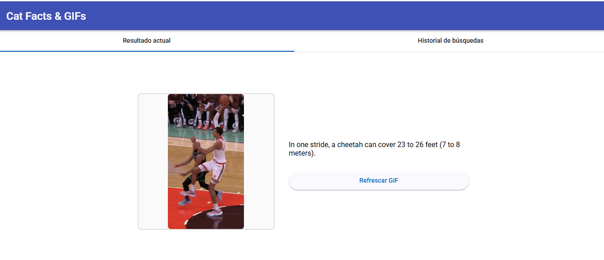

# 🐱 CatFactsApp.Frontend

Frontend de la aplicación **CatFactsApp**, desarrollado con **Angular 19**, **Angular Material** y una estructura modular basada en componentes standalone y buenas prácticas.

Esta aplicación permite al usuario visualizar un dato aleatorio sobre gatos junto con un GIF relacionado, además de consultar un historial de búsquedas anteriores obtenidas desde el backend.

---

## 🧰 Tecnologías utilizadas

| Tecnología       | Versión |
| ---------------- | ------- |
| Angular          | 19.1.x  |
| Angular Material | 19.2.x  |

---

## 📁 Estructura del proyecto

```text
src/app/
├── core/
│   ├── models/           → Interfaces para comunicación con el backend
│   ├── services/         → Servicios HTTP para consumir la API
│   └── shared/           → Funcionalidades reutilizables (paginador personalizado)
│
├── features/
│   ├── current-result/   → Componente standalone que muestra fact + GIF
│   └── history/          → Componente standalone que muestra historial
│
├── app.component.ts      → Contenedor principal con tabs de Angular Material
└── app.component.html    → UI principal con tabs y encabezados
```

---

## 🚀 Instalación y ejecución

### 1. Clona el repositorio

```bash
git https://github.com/staradrik/CatFactsApp.Frontend.git
cd CatFactsApp.Frontend
```

### 2. Instala las dependencias

```bash
npm install
```

### 3. Inicia la aplicación

```bash
npm start
```

La aplicación estará disponible en:
📍 [http://localhost:4200](http://localhost:4200)

> ⚠️ **Importante**: Asegúrate de que el backend (`CatFactsApp.Backend`) esté en funcionamiento.
> La URL de la API se configura en el archivo `environment.development.ts`.

---

## 🔗 Comunicación con el backend

El frontend se comunica exclusivamente con el backend desarrollado en **.NET**. Toda la interacción con APIs externas (Cat Fact / Giphy) es gestionada desde el backend.

| Método | Endpoint                  | Descripción                                             |
| ------ | ------------------------- | ------------------------------------------------------- |
| GET    | `/api/fact/with-gif`      | Retorna un fact aleatorio con un GIF y guarda historial |
| GET    | `/api/fact/gif?query=...` | Devuelve un nuevo GIF usando la misma query             |
| GET    | `/api/fact/history`       | Obtiene el historial completo de búsquedas              |

---

## 🖥️ Funcionalidades de la interfaz

### 🟦 Tab: Resultado actual

* Muestra un **dato aleatorio** sobre gatos junto con su **GIF**.
* Botón para **actualizar únicamente el GIF**, reutilizando la query.
* Indicador de carga (`mat-spinner`) para una mejor experiencia de usuario.
* Diseño responsive centrado utilizando `flex`.

### 🟨 Tab: Historial de búsquedas

* Tabla con las siguientes columnas:

  * Fecha de búsqueda
  * Texto completo del fact
  * Query de búsqueda (3 palabras clave)
  * GIF mostrado
* Paginación integrada con `MatPaginator`.
* Uso de `MatTableDataSource` para manejo eficiente de datos y paginación.

## 📸 Capturas de pantalla

### Resultado actual



### Historial de búsquedas


